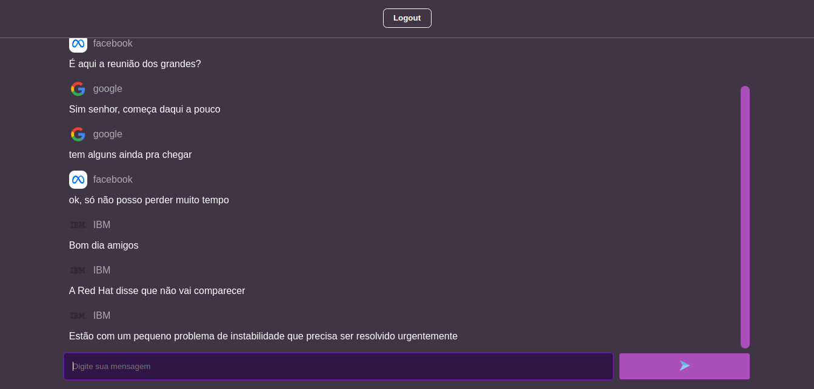

# Discord clone

Web app inspirado no chat do discord.

### Clique [Aqui](https://spsam-discordclone.vercel.app/) para testar a aplicação.



> Discord clone é uma aplicação web inspirada no chat do Discord, onde é possível conversar em tempo real com seus amigos.

## Tecnologias utilizadas
* HTML
* CSS in JS
* JavaScript
* React
* React Hooks
* Context API
* Next.js
* Supabase (Back-end as a service)

## Pré-requisitos
* Instale a última versão do [Node](https://nodejs.org/en/);
* Para garantir o funcionamento de todas as funcionalidades da aplicação é recomendado o uso do [Google Chrome](https://www.google.com/intl/pt-BR/chrome/);
* Para clonar o repositório instale e configure o [git](https://git-scm.com/).

## Executando a build do projeto
* Abra um terminal e faça a clonagem do repositório
```bash
git clone https://github.com/SP-Sam/discord-clone.git

# Se você tem uma chave SSH configurada
git@github.com:SP-Sam/discord-clone.git
```
* Acesse o diretório do projeto clonado
```bash
cd discord-clone
```
* Instale as dependências do projeto
```bash
npm install
```
* Crie a build do projeto
```bash
npm run build
```
* Inicie a aplicação
```bash
npm start
```
* Abra `http://localhost:3000` no navegador e envie uma mensagem amigável.

## Desenvolvedor
<a href="https://www.linkedin.com/in/spsam/">
  
  <br>
  <b>Samuel Pereira</b>
</a>

## Licença
Este projeto foi desenvolvido para fins de estudo, não está licenciado e não possui fins lucrativos.

[⬆️ Voltar ao topo](#discord-clone)
<br>